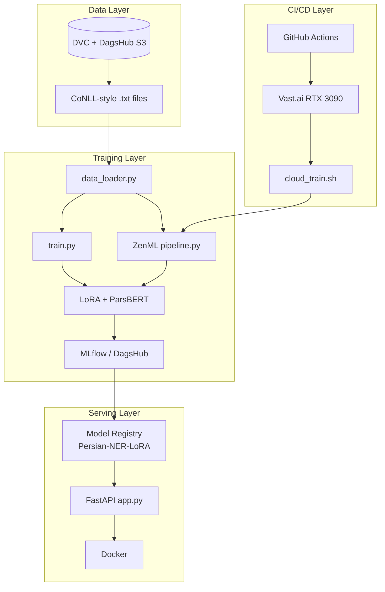

# ParsBERT NER · LoRA · MLOps

<p align="center">
  <strong>End-to-end Persian Named Entity Recognition</strong><br/>
  LoRA fine-tuning · MLflow tracking · DagsHub Model Registry · ZenML orchestration · DVC · FastAPI serving
</p>

<p align="center">
  <a href="https://github.com/Amirhosseinesbati/parsbert-ner-lora-binary">GitHub</a> ·
  <a href="https://dagshub.com/amiresbati52/NER-LoRA-MLOps">DagsHub</a> ·
  
  
  
</p>

---

## Table of Contents

- [Overview](#overview)
- [Skills Demonstrated](#skills-demonstrated)
- [Architecture](#architecture)
- [Tech Stack](#tech-stack)
- [Project Structure](#project-structure)
- [Model & Training](#model--training)
- [MLOps Workflow](#mlops-workflow)
- [API](#api)
- [Getting Started](#getting-started)
- [Environment Variables](#environment-variables)
- [GitHub Secrets](#github-secrets)
- [Technical Notes](#technical-notes)
- [Roadmap](#roadmap)
- [Author](#author)
- [License](#license)

---

## Overview

This repository implements a **production-oriented MLOps pipeline** for **Persian Named Entity Recognition**. The base model [`HooshvareLab/bert-fa-base-uncased`](https://huggingface.co/HooshvareLab/bert-fa-base-uncased) (ParsBERT) is fine-tuned with **LoRA (PEFT)** for **binary token-level classification**:

| Label | Meaning |
|--------|---------|
| `O` | Non-entity token |
| `B-ENTITY` | Beginning of an entity span |

> **Note:** This version focuses on **binary entity detection** (Entity vs. Non-Entity), not multi-class NER with labels such as `PER`, `LOC`, or `ORG`.

The project is designed as a **portfolio / resume piece**: it demonstrates the full ML lifecycle—from versioned data and GPU training to model registry, REST inference, Docker, and CI-triggered cloud training.

---

## Skills Demonstrated

- End-to-end **NLP pipeline** with Hugging Face Transformers and PEFT/LoRA  
- **Parameter-efficient fine-tuning** with reduced trainable weights and mixed-precision (`fp16`)  
- **Experiment tracking** and model logging with **MLflow** on **DagsHub**  
- **Model Registry** with automatic loading of the Production stage in the API  
- **Pipeline orchestration** with **ZenML** (`load → tokenize → train`)  
- **Data versioning** with **DVC** and a DagsHub S3 remote (~18,000 text files)  
- **Continuous training** via GitHub Actions and on-demand **Vast.ai** GPU instances  
- **Production REST API** with FastAPI, lifespan hooks, and hot model refresh  
- **Containerized deployment** with Docker (CPU PyTorch for lightweight inference)  

---

## Architecture



---

## Tech Stack

| Area | Tools |
|------|--------|
| Language | Python 3.10 |
| Base model | `HooshvareLab/bert-fa-base-uncased` |
| Fine-tuning | PEFT · LoRA (`r=16`, `α=32`, `query` / `value`) |
| Framework | PyTorch · Hugging Face Transformers · Datasets |
| Tracking / Registry | MLflow · DagsHub |
| Orchestration | ZenML |
| Data | DVC (DagsHub S3 remote) |
| API | FastAPI · Uvicorn |
| Containers | Docker |
| CI/CD | GitHub Actions · Vast.ai CLI |
| Metrics | scikit-learn (precision, recall, F1, accuracy) |

---

## Project Structure

```text
parsbert-ner-lora-binary/
├── src/
│   ├── config.py          # Hyperparameters, labels, paths
│   ├── data_loader.py     # Download/load, tokenize, label alignment
│   ├── train.py           # Direct training script + MLflow
│   ├── pipeline.py        # ZenML pipeline (3 steps)
│   ├── app.py             # FastAPI — load model from Registry
│   └── test_api.py        # Sample client for /predict
├── Notebooks/
│   └── parsbert_ner_lora_binary.ipynb
├── saved_model/           # LoRA adapter and checkpoints (local artifacts)
├── data.dvc               # Pointer to versioned dataset
├── .dvc/                  # DagsHub remote configuration
├── .zen/                  # ZenML project metadata
├── .github/workflows/
│   └── mlops-ct.yml       # Continuous training on Vast.ai
├── cloud_train.sh         # Cloud training: DVC pull → ZenML → teardown
├── setup_vast.sh          # Initial Vast.ai instance setup
├── Dockerfile             # Inference image
├── requirements.txt
└── LICENSE                # MIT — Amirhossein Esbati
```

---

## Model & Training

### Hyperparameters (`src/config.py`)

| Parameter | Value |
|-----------|--------|
| `MAX_LEN` | 256 |
| `BATCH_SIZE` | 16 (cloud pipeline: 4) |
| `LEARNING_RATE` | 2e-4 |
| `EPOCHS` | 10 |
| `WEIGHT_DECAY` | 0.01 |
| LoRA `r` / `alpha` / `dropout` | 16 / 32 / 0.1 |
| `TARGET_MODULES` | `query`, `value` |
| `modules_to_save` | `classifier` |

### Dataset

- Format: `.txt` files with `token label` per line  
- DVC-tracked volume: **18,269 files** (~6.8 MB metadata)  
- Split: **70% train · 15% validation · 15% test** (`seed=42`)  
- Fallback: automatic Dropbox download in `data_loader.py` when data is missing locally  

### Training outputs

- Checkpoints and `best_model/` under `./saved_model`  
- MLflow experiments (e.g. `ParsBERT_NER_Experiment`, `NER_LoRA_ZenML_Pipeline`)  
- Registered model name: **`Persian-NER-LoRA`**

---

## MLOps Workflow

```text
1. Push to main (changes under src/ or workflows)
        ↓
2. GitHub Actions → rent cheapest available RTX 3090 on Vast.ai
        ↓
3. cloud_train.sh:
   · DVC pull from DagsHub S3
   · Run ZenML pipeline (pipeline.py)
   · trap: destroy instance on exit (cost control)
        ↓
4. Log metrics and artifacts to MLflow
        ↓
5. Promote best version to Production in Model Registry
        ↓
6. FastAPI downloads and serves the Production model
        ↓
7. POST /refresh-model to reload without full service restart
```

---

## API

### `GET /`

Service metadata.

### `POST /predict`

**Request:**

```json
{
  "text": "علی به همراه حسن در تهران به دانشگاه شریف رفت."
}
```

**Response:**

```json
{
  "text": "علی به همراه حسن در تهران به دانشگاه شریف رفت.",
  "entities": [
    { "word": "علی", "entity": "ENTITY" },
    { "word": "تهران", "entity": "ENTITY" }
  ]
}
```

### `POST /refresh-model`

Reloads the LoRA adapter from the latest **Production** registry version in the background.

---

## Getting Started

### Prerequisites

- Python 3.10+  
- GPU with CUDA recommended for training (`fp16` enabled)  
- `DAGSHUB_TOKEN` required for API and cloud training  

### Install

```bash
git clone https://github.com/Amirhosseinesbati/parsbert-ner-lora-binary.git
cd parsbert-ner-lora-binary
python -m venv venv

# Windows
venv\Scripts\activate

# Linux / macOS
source venv/bin/activate

pip install -r requirements.txt
```

### Train locally

```bash
# Direct script
cd src && python train.py

# ZenML pipeline
python src/pipeline.py
```

### Run the API

```bash
cd src

# Windows CMD
set DAGSHUB_TOKEN=your_token

# PowerShell
# $env:DAGSHUB_TOKEN="your_token"

uvicorn app:app --host 0.0.0.0 --port 8000
```

Interactive docs: `http://localhost:8000/docs`

### Docker

```bash
docker build -t parsbert-ner-api .
docker run -p 8000:8000 -e DAGSHUB_TOKEN=your_token parsbert-ner-api
```

### Test the API

```bash
python src/test_api.py
```

### Example cURL request

```bash
curl -X POST "http://localhost:8000/predict" \
  -H "Content-Type: application/json" \
  -d "{\"text\": \"محمد در اصفهان کار می‌کند.\"}"
```

---

## Environment Variables

| Variable | Purpose |
|----------|---------|
| `DAGSHUB_TOKEN` | DagsHub / MLflow / DVC S3 authentication |
| `MLFLOW_TRACKING_USERNAME` | Set to `amiresbati52` in `app.py` |
| `MLFLOW_TRACKING_PASSWORD` | Typically the DagsHub token |
| `VAST_API_KEY` | CI/CD and cloud instance teardown |
| `HF_TOKEN` | Optional, for private Hugging Face models |

> **Security:** Never commit tokens or `.env` files. Store secrets in **GitHub Actions → Repository secrets**.

---

## GitHub Secrets

| Secret | Description |
|--------|-------------|
| `VAST_API_KEY` | Vast.ai API key |
| `DAGSHUB_TOKEN` | DagsHub token for cloud training and MLflow |

---

## Technical Notes

1. **Class imbalance:** In this binary setup, `O` tokens dominate; high accuracy does not imply strong entity-level F1. For production, consider `class_weight`, oversampling, or `seqeval` metrics.  
2. **Two training paths:** `train.py` for quick runs; `pipeline.py` for reproducibility and the ZenML dashboard.  
3. **Inference:** The API downloads only the **LoRA adapter** from the registry and mounts it on the base ParsBERT model (`PeftModel.from_pretrained`).  
4. **Docker:** The image uses CPU PyTorch for lightweight, GPU-free deployment.

---

## Roadmap

- [ ] Multi-class NER (`PER`, `LOC`, `ORG`, …)  
- [ ] Entity-level metrics (`seqeval`) and automated promotion gates  
- [ ] API authentication (API key / OAuth)  
- [ ] Latency and model drift monitoring  
- [ ] Deploy on Kubernetes or Cloud Run  

---

## Author

**Amirhossein Esbati**

| | |
|---|---|
| GitHub | [Amirhosseinesbati](https://github.com/Amirhosseinesbati) |
| Repository | [parsbert-ner-lora-binary](https://github.com/Amirhosseinesbati/parsbert-ner-lora-binary) |
| DagsHub | [NER-LoRA-MLOps](https://dagshub.com/amiresbati52/NER-LoRA-MLOps) |

---

## License

This project is released under the [MIT License](LICENSE) — Copyright (c) 2026 Amirhossein Esbati.
